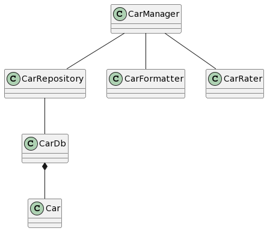
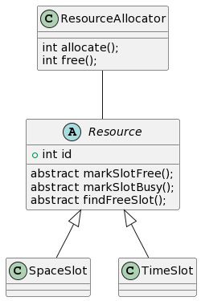
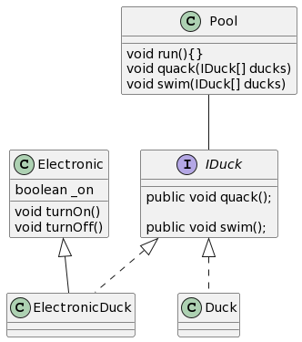
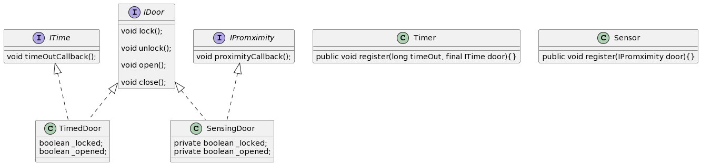
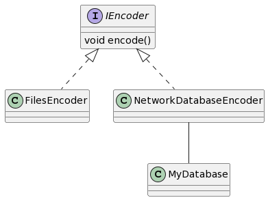

<h3  style="color:#EFEFEF" > SRP: Single Responsability Principle  </h3>

Probleme:
La class CarManager implémente toutes les méthodes et il n'y a pas le "Separation of concern"

Solution:

En utilisant la SRP, on  sépare la logique de CarManager en 3 classes principales Cardb contenant   la base de donné, CarRepository qui est le DAO, CarFormatter pour le formatage et CarRater pour la stratégie de comparaison Dans ce cas, toutes classe a une seul responsabilité.

<h3 style="color:#EFEFEF" > OCP : The Open/Closed Principle </h3>

Probleme:
La classe RessourceAllocator contient toutes les méthodes pour libérer, réserver, rechercher des slots libres selon les types mais l'allocation et la libération sont différent espour chacunes de ces methodes selon le type des ressources

Solution:
Construire une interface Resource et utiliser seulement l'interface 'Resource' pour le traitement de Slots différents dans RessourceAllocator

<h3> LSP : The LisKov Substitution Principle </h3>

Probleme:
Le problem dans cette implémentation est que nous devons utiliser des if et des else partout dans notre code pour réaliser un traitement sur mesure pour chaque nouvelle classe qui implémente l'interface principlae ce qui fait que notre code ne serait plus maintenable.

Solution:
On a besoin de créer une interface pour la class Duck et une pour Electric contentant les methodes spécifique a electrique ( turn on and off ).

<h3  style="color:#EFEFEF" > ISP : Interface Segregation Principle </h3>

Probleme:
Ici, on a beaucoup de classes concrètes différentes héritant d'une seule interface contenant des méthodes implémentées par quelques clases et d'autres qui ne fasses rien du tout.

Solution:
Maintenant, TimedDoor implémente Door et ITime et SensingDoor implémente ISensor en plus que Door. Ainsi, notre code et plus facilement extensible et plus maintenable.

<h3  style="color:#EFEFEF" > DIP: Dependency Inversion Principle </h3>

Probleme:
Le problème ici est que le EncodingModule est un peu déroutant. EncodeWithFiles() et encodeBasedOnNetworkAndDatabase() sont trés différents et devraient être implémentés différemment. Par example, seul la 2éme fonction utilise MyDatabase.

Solution:
Pour remédier à ce probleme, on éclate le encoding module grâce au DIP. Dans ce cas, on a une interface Encoder contenat la méthode encode. et 2 classes concretes.

